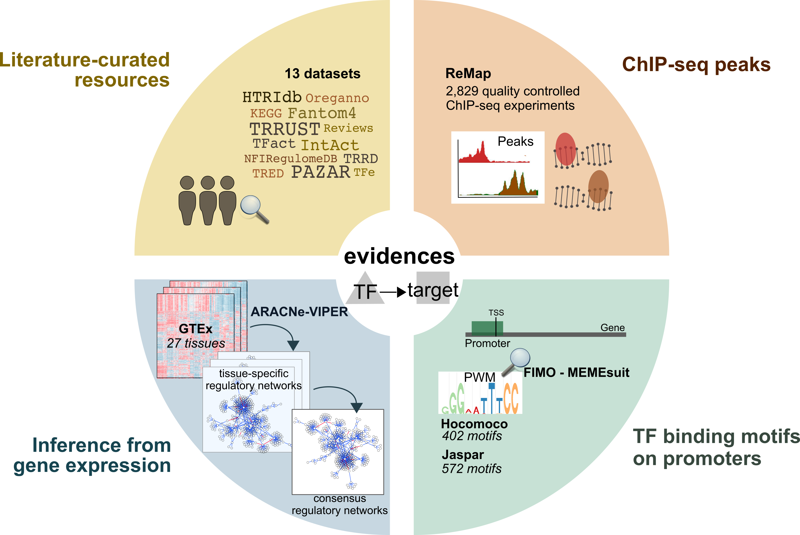

--- 
title: "DoRothEA regulons."
author:
- name: Pau Badia i Mompel
  affiliation: Institute for Computational Biomedicine, Heidelberg University
  email: pau.badia@uni-heidelberg.de
   
package: dorothea
output:
  BiocStyle::html_document
vignette: |
  %\VignetteIndexEntry{DoRothEA regulons.}
  %\VignetteEngine{knitr::rmarkdown}
  %\VignetteEncoding{UTF-8}
---

```{r setup, include=FALSE}
knitr::opts_chunk$set(
    collapse = TRUE,
    comment = "#>"
)
```

# Introduction

DoRothEA is a gene regulatory network (GRN) containing signed transcription factor
(TF) - target gene interactions. DoRothEA regulons, the collection of TFs and
their transcriptional targets, were curated and collected from different types of
evidence for both human and mouse.



For each TF-target interaction we assigned a confidence level based on the
number of supporting evidence. The confidence assignment comprises five levels,
ranging from A (highest confidence) to E (lowest confidence). Interactions that
are supported by all four lines of evidence, manually curated by experts in
specific reviews, or supported both in at least two curated resources are
considered to be highly reliable and were assigned an A level. Level B-D are
reserved for curated and/or ChIP-seq interactions with different levels of
additional evidence. Finally, E level is used for interactions that are
uniquely supported by computational predictions. To provide the most confident
regulon for each TF, we aggregated the TF-target interactions with the highest
possible confidence score that resulted in a regulon size equal to or greater
than ten targets. The final confidence level assigned to the TF regulon is the
lowest confidence score of its component targets.

# Activity estimation
DoRothEA regulons can be coupled with any statistical method to infer TF
activities from bulk or single-cell transcriptomics.
In this vignette we just show how to access these regulons and some of their
properties. To infer TF activities, please check out
[decoupleR](https://doi.org/10.1093/bioadv/vbac016), available in
[R](https://saezlab.github.io/decoupleR/) or
[python](https://github.com/saezlab/decoupler-py).

# Load
First we load the necessary packages:
```{r load, message=FALSE}
library(dorothea)
library(decoupleR)
library(ggplot2)
library(dplyr)
```

Here is how to retrieve all regulons from human:
```{r model}
net <- decoupleR::get_dorothea(levels = c('A', 'B', 'C', 'D'))
head(net)
```

Here we can observe some of the target genes for the TF ADNP. We can see their
confidence level, in this case D, and their mode of regulation, in this case
positive. To better estimate TF activities, we recommend to select regulons from
the confidence levels A, B and C.

# Exploration
We can observe the total number of genes per TF:
```{r n_genes}
n_genes <- net %>%
  group_by(source) %>%
  summarize(n = n())

ggplot(data=n_genes, aes(x=n)) +
  geom_density() +
  theme(text = element_text(size=12)) +
  xlab('Number of target genes') +
  ylab('densities') +
  theme_bw() +
  theme(legend.position = "none")

```

The majority of TFs have around 20 target genes, but there are some that reach
more than 1000. 

Additionally, we can visualize how many edges each confidence level adds:
```{r n_edges}
n_edges <- net %>%
  group_by(confidence) %>%
  summarize(n = n())

ggplot(data=n_edges, aes(x=confidence, y=log10(n), color=confidence, fill=confidence)) +
  geom_bar(stat="identity") +
  theme(text = element_text(size=12)) +
  xlab('Confidence') +
  ylab('log10(Number of edges)') +
  theme_bw() +
  theme(legend.position = "none")

```

Each confidence level contributes around 10,000 TF - target relationships, B
and E being the exceptions. 

We can also check how many TFs are repressors, TFs with most of their edges with
negative mode of regulation (`mor`), and how many are activators, TFs with most
of their edges with positive `mor`:

```{r prop}
prop <- net %>%
  mutate(mor = case_when(mor < 0 ~ -1, mor > 0 ~ 1)) %>%
  group_by(source, mor) %>%
  summarize(n = n()) %>%
  mutate(freq = n / sum(n)) %>%
  filter(mor == 1)

ggplot(data=prop, aes(x=freq)) +
  geom_density() +
  theme(text = element_text(size=12)) +
  xlab('% of positive edges') +
  ylab('densities') +
  theme_bw() +
  theme(legend.position = "none")

```

Most TFs in DoRothEA are activators, but there are also some of them that
are repressors.

# CollecTRI

Recently, we have released a new literature based GRN with increased coverage and better
performance at identifying perturbed TFs, called [CollecTRI](https://github.com/saezlab/CollecTRI).
We encourage users to use CollecTRI instead of DoRothEA. Vignettes on how to
obtain activities are available at the [decoupleR package](https://saezlab.github.io/decoupleR/).

Here's how to access it. The argument `split_complexes` keeps complexes or
splits them into subunits, by default we recommend to keep complexes together.

```{r collectri}
net <- decoupleR::get_collectri(split_complexes = FALSE)
head(net)
```

We can observe the total number of genes per TF:
```{r n_genes_collectri}
n_genes <- net %>%
  group_by(source) %>%
  summarize(n = n())

ggplot(data=n_genes, aes(x=n)) +
  geom_density() +
  theme(text = element_text(size=12)) +
  xlab('Number of target genes') +
  ylab('densities') +
  theme_bw() +
  theme(legend.position = "none")

```

Similarly to DoRothEA, the majority of TFsin CollecTRI have around 20 target genes, but
there are some that reach more than 1000.

We can also check how many TFs are repressors, TFs with most of their edges with
negative mode of regulation (`mor`), and how many are activators, TFs with most
of their edges with positive `mor`:

```{r prop_collectri}
prop <- net %>%
  mutate(mor = case_when(mor < 0 ~ -1, mor > 0 ~ 1)) %>%
  group_by(source, mor) %>%
  summarize(n = n()) %>%
  mutate(freq = n / sum(n)) %>%
  filter(mor == 1)

ggplot(data=prop, aes(x=freq)) +
  geom_density() +
  theme(text = element_text(size=12)) +
  xlab('% of positive edges') +
  ylab('densities') +
  theme_bw() +
  theme(legend.position = "none")

```

As seen in DoRothEA, Most TFs in CollecTRI are also activators.